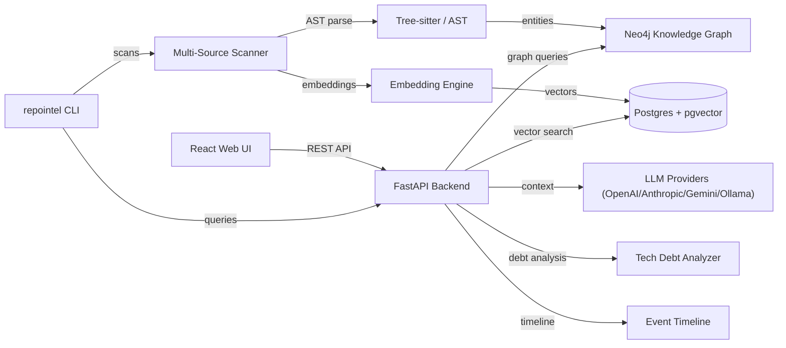
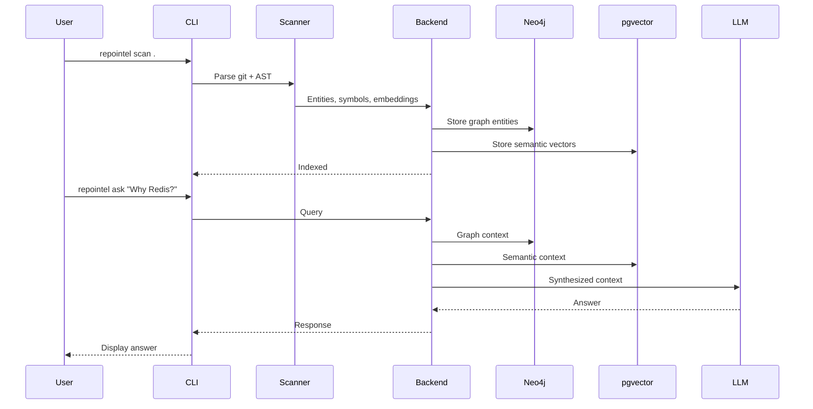

# Repository Intelligence Platform

AI-powered repository intelligence platform. Semantic search, AST code understanding, knowledge graph exploration, technical debt analysis, and context-aware LLM assistance.

## Overview

Parses git history and source code to build a searchable knowledge graph. Extracts symbols, definitions, calls, and imports using AST parsers. Stores semantic vectors in pgvector and entities in Neo4j. Includes a CLI tool (`repointel`), a React web UI, and a FastAPI backend with pluggable LLM providers.

## Core Architecture



## System Components

| Component | Responsibility |
|-----------|---------------|
| `cli/` | `repointel` CLI — scan, index, search, graph, timeline, debt, ask, serve |
| `backend/` | FastAPI REST API, AST parsing, embedding, LLM orchestration |
| `frontend/` | React web UI — search, graph visualization, timeline, chat |
| `docker/` | Docker configuration and entrypoints |
| `tests/` | Backend and integration test suite |
| `docs/` | Architecture, API, knowledge graph, development, deployment guides |

## Repository Layout

| Directory | Purpose |
|-----------|---------|
| `cli/` | Command-line interface tool |
| `backend/` | FastAPI backend application |
| `frontend/` | React web interface |
| `docker/` | Docker deployment files |
| `tests/` | Test suites |
| `docs/` | Documentation |

## Technology Stack

| Layer | Technology | Purpose |
|-------|-----------|---------|
| Frontend | React | Web UI |
| Backend | FastAPI + Python | REST API |
| Graph DB | Neo4j | Knowledge graph (entities, calls, imports) |
| Vector DB | Postgres + pgvector | Semantic code and doc search |
| Parsing | Tree-sitter | AST parsing (Python, TypeScript, JS) |
| LLM | OpenAI / Anthropic / Gemini / Ollama / Mock | Context-aware AI assistant |
| CLI | Python (Click/Typer) | `repointel` command-line tool |
| Container | Docker Compose | Deployment orchestration |

## Requirements

- Python 3.10+
- Node.js 18+
- npm
- Neo4j
- Postgres with pgvector
- Docker and Docker Compose (recommended)

## Configuration

| File | Purpose |
|------|---------|
| `docker-compose.yml` | Service orchestration |
| `backend/.env` | Backend configuration |
| `frontend/.env` | Frontend configuration |
| `.pre-commit-config.yaml` | Pre-commit hooks |
| `docs/` | Architecture and deployment guides |

## Getting Started

```bash
# With Docker Compose
docker compose up --build

# CLI installation
pip install -e cli/

# CLI usage
repointel scan .
repointel index
repointel search "authentication system"
repointel graph
repointel timeline
repointel debt
repointel ask "Why was Redis introduced?"
repointel serve
```

## Development

See `docs/Development.md` for full setup instructions.

## Request / Data Flow


